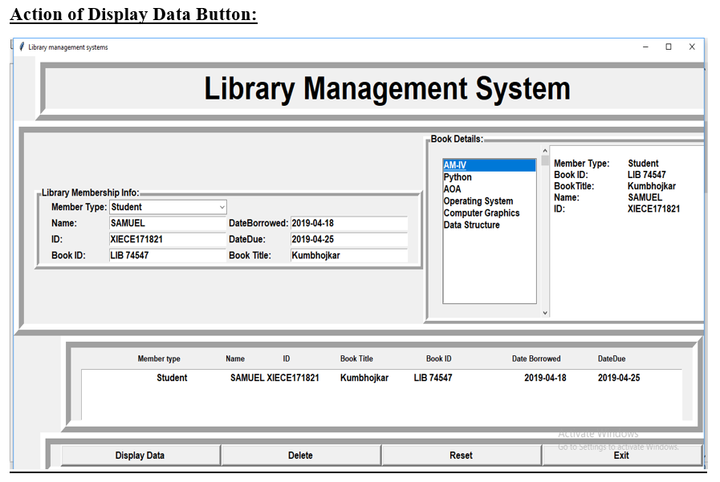
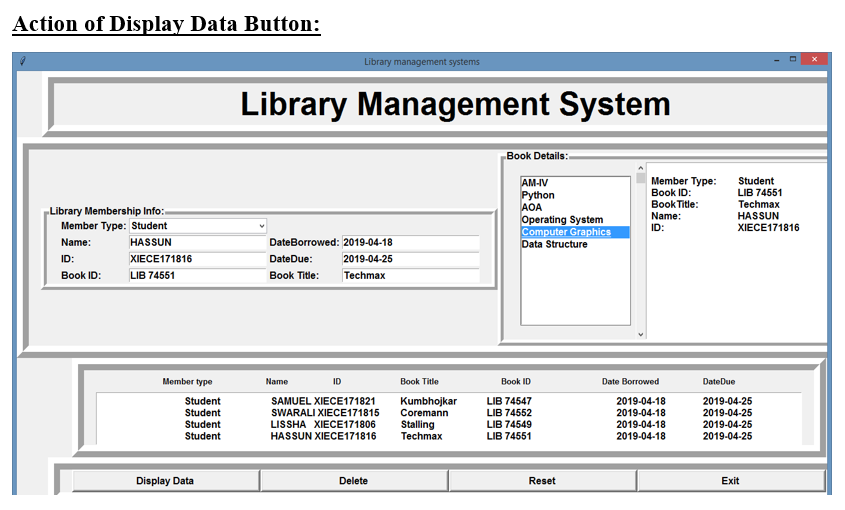
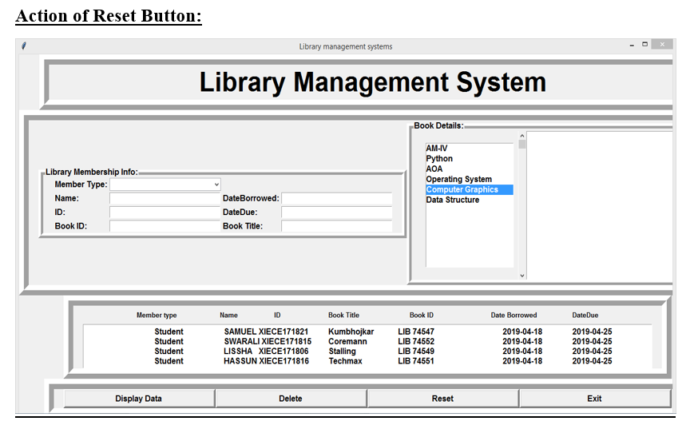
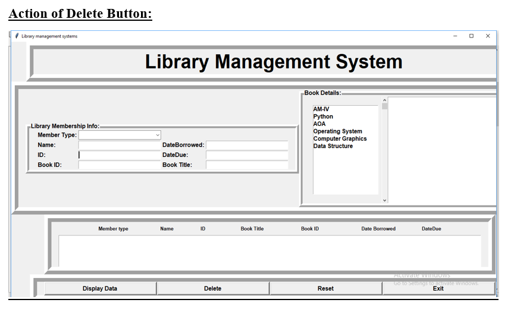
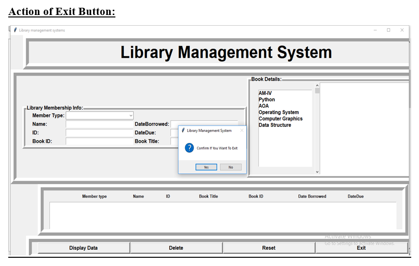

Here's a well-structured **`README.md`** file for your **Library Management System using Python Tkinter** to boost your GitHub profile and help you land a high-paying job.  

---

### 📚 Library Management System using Python (Tkinter)  

#### 📖 Introduction  
The **Library Management System** is a **GUI-based application** built using **Python and Tkinter** to manage book records efficiently. It provides an interactive interface for adding, deleting, issuing, and searching books, making it an ideal solution for small libraries.The project titled Library Management System is Library Management software for monitoring and controlling the transactions in a library .The project “Library Management System” is developed in php, which mainly focuses on basic operations in a library like adding new books, and updating new information, searching books and members and return books.

This project of **“LIBRARY MANAGEMENT”** of gives us the complete information about the library. We can enter the record of new books and retrieve the details of books available in the library. We can issue the books to the students and maintain their records and can also check how many books are issued and stock available in the library. In this project we can maintain the late fine of students who returns the issued books after the due date.

Throughout the project the focus has been on presenting information and comments in an easy and intelligible manner. The project is very useful for those who want to know about Library Management System.

#### 🎯 Objective  
The goal of this project is to develop a **user-friendly and efficient** library system that allows seamless book management while demonstrating strong **Python programming and GUI development skills**. The **main objective** of the Python Project on **Library Management System** is to manage the details of **Member, Books,Student,  Id ,Issues, Name, Date Borrowed,Date Due**. It manages all the information about Member, Librarian, Name, Date Borrowed,Date Due,Id.  

#### 🚀 Features  
✔️ **Add Books** – Store book details like title and book number.  
✔️ **Delete Books** – Remove books from the system.  
✔️ **Search Books** – Find books using their name or number.  
✔️ **Issue Books** – Keep track of borrowed books with issue dates.  
✔️ **Return Books** – Manage book returns efficiently.  
✔️ **Display Books** – View all available books in a structured format.  

#### 🏗️ Proposed System  
This project is built using:  
- **Python** for backend logic.  
- **Tkinter** for creating a user-friendly GUI.  
- **PHP** for persistent book storage.  

#### 🔲 Block Diagram  
```
+------------------+
|  Main Menu       |
+------------------+
+------------------+
|  Add Book       |
|  Delete Book    |
|  Search Book    |
|  Issue Book     |
|  Return Book    |
|  View Books     |
|  Exit           |
+------------------+
```

#### 📸 Screenshots  
# 
# 
# 
# 
# 


#### 🛠️ Future Improvements  
🔹 Implement **user authentication** for library staff.  
🔹 Add **due date tracking & fine calculation** for book returns.  
🔹 Improve **UI/UX with modern themes**.  
🔹 Convert to a **web-based system using Flask/Django**.  

---

#### 📌 Why This Project?  
This project highlights **Python programming**, **GUI development**, and **database handling skills**, making it perfect for **Software Development and Data Management roles**.  

Feel free to connect if you have questions or suggestions for improving this dashboard! 
## 📫 Let's Connect  
- **LinkedIn**: [Swarali U. Gaonkar](https://www.linkedin.com/in/swaraligaonkar/)  
- **GitHub**: [swaraligk](https://github.com/swaraligk)  
- **Email**: swaraligk16@gmail.com  
